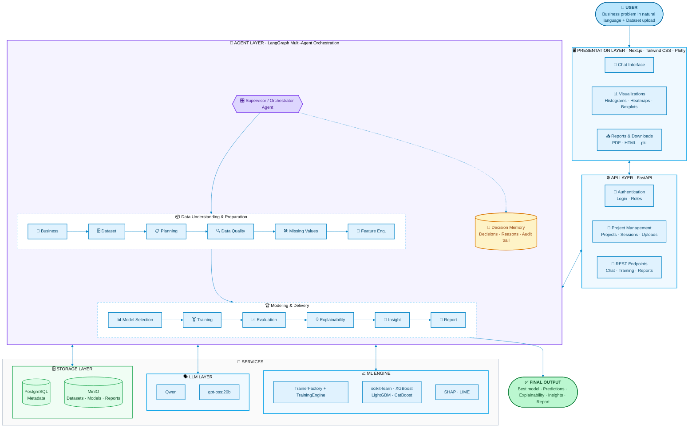

#  MLCopilot

### Multi-Agent Conversational Machine Learning Automation Platform

*Upload a dataset. Describe the problem. Receive a complete, explainable ML solution.*

[Overview](#-overview) •
[Features](#-key-features) •
[Architecture](#-system-architecture) •
[Agents](#-the-13-agents) •
[Workflow](#-agent-orchestration-workflow) •
[Comparison](#-mlcopilot-vs-existing-automl-platforms) •
[Tech Stack](#-technology-stack) •
[Roadmap](#-roadmap)

---

## 📖 Overview

**MLCopilot** is an AI-powered, multi-agent platform that automates the complete machine learning lifecycle through natural-language conversation. Instead of manually performing preprocessing, feature engineering, model selection, training, evaluation, and insight generation, users work with a **team of 13 specialized agents** that collaborate, debate, and justify decisions like a real-world Data Science team.

> **Goal:** *"Upload a dataset, describe the problem, and receive a complete machine learning solution with explanations and insights."*

---

## 🎯 Problem Statement

Building ML solutions demands expertise across many disciplines:

| Data Preparation | Modeling | Interpretation |
|---|---|---|
| Data cleaning | Model selection | Model evaluation |
| Missing value handling | Hyperparameter optimization | Business interpretation |
| Outlier detection | Feature selection | Explainability |
| Feature engineering | Cross-validation | Reporting |

Existing AutoML tools focus mainly on **model training** and offer limited transparency or business reasoning. MLCopilot fills that gap by:

- 🧠 Understanding business requirements from plain language
- 🤝 Coordinating specialized AI agents
- 🔍 Explaining every decision it makes
- 💡 Producing actionable business insights
- ⚙️ Automating the ML workflow end to end

---

## ✨ Key Features

| | Feature | Description |
|---|---|---|
| 💬 | **Conversational ML** | Build, explain, and inspect models through chat |
| 🧑‍🤝‍🧑 | **Multi-Agent Collaboration** | Agents discuss, debate, and reach consensus |
| 🔎 | **Auto Data Profiling** | Dataset summary, quality score, feature catalog |
| 🧹 | **Automated Preprocessing** | Imputation, outlier handling, encoding, scaling |
| 🏆 | **Model Selection with Reasoning** | Shortlists models and explains *why* |
| 📊 | **Explainability** | SHAP / LIME feature importance and prediction explanations |
| 📝 | **Automated Reports** | Dynamic PDF / DOCX / HTML reports for classification and regression |
| 🧾 | **Decision Memory** | Full audit trail of every decision and reason |
| 📦 | **Model Export** | Download trained models as `.pkl` |

---

## 🏗️ System Architecture



### Architecture Layers

| Layer | Responsibility | Technology |
|---|---|---|
| **Presentation** | Chat UI, charts, downloads | Next.js, Tailwind CSS, Plotly |
| **API** | Auth, projects, orchestration entry point | FastAPI |
| **Agent** | Multi-agent reasoning and collaboration | LangGraph |
| **ML Engine** | Training, tuning, evaluation | scikit-learn, XGBoost, LightGBM, CatBoost |
| **Explainability** | Model interpretation | SHAP, LIME |
| **LLM** | Natural-language understanding and insights | Qwen, gpt-oss:20b |
| **Storage** | Metadata and artifacts | PostgreSQL, MinIO |

---

## 👥 The 13 Agents

| # | Agent | Role / Responsibilities | Key Outputs |
|:-:|---|---|---|
| 1 | ⚙️ **Supervisor / Orchestrator** | Coordinates the workflow, manages agent execution and dependencies, resolves conflicts, ensures end-to-end completion | Execution plan, agent coordination, final result |
| 2 | 🎯 **Business Agent** | Understands the business problem and goals from natural language; determines problem type, success metrics, constraints | Business understanding, problem type, success metric |
| 3 | 🗄️ **Dataset Agent** | Analyzes dataset structure, data types, target column, feature distributions, basic statistics | Dataset summary, feature types, initial insights |
| 4 | 📋 **Planning Agent** | Creates a step-by-step ML plan covering preprocessing, feature engineering, model candidates, evaluation strategy | Execution plan, model list, evaluation strategy |
| 5 | 🔍 **Data Quality Agent** | Checks missing values, duplicates, outliers, inconsistencies; provides recommendations | Data quality report, cleaning recommendations |
| 6 | 🛠️ **Missing Values Agent** | Selects and applies imputation (mean / median / mode / KNN / advanced) | Imputed dataset, imputation strategy |
| 7 | 🧬 **Feature Engineering Agent** | Encoding, scaling, normalization, date transforms, feature selection, new features | Transformed dataset, engineered features |
| 8 | 📊 **Model Selection Agent** | Picks suitable models based on problem type, data characteristics, business goals | Candidate models with reasoning |
| 9 | 🏋️ **Training Agent** | Trains selected models via TrainerFactory + TrainingEngine; cross-validation and hyperparameter tuning | Trained models, training logs, tuned parameters |
| 10 | 📈 **Evaluation Agent** | Evaluates models with appropriate metrics and compares performance | Evaluation metrics, model comparison, best model |
| 11 | 💡 **Explainability Agent** | Generates SHAP / LIME explanations in business-friendly language | SHAP plots, feature importance, business insights |
| 12 | 📑 **Insight Agent** | Converts results and explanations into actionable recommendations | Business insights, recommendations |
| 13 | 📄 **Report Agent** | Generates the comprehensive ML report with methodology and performance | Final report (PDF / HTML), visualizations, summary |

> 🧾 A cross-cutting **Decision Memory** component records every decision, the reason, and the responsible agent for a fully explainable audit trail.

---

## 🔄 Agent Orchestration Workflow

```text
User Input (business problem + dataset)
        │
        ▼
1. Supervisor / Orchestrator Agent
        │
        ├─► 2. Business Agent ──► 3. Dataset Agent ──► 4. Planning Agent
        │
        ├─► 5. Data Quality Agent ──► 6. Missing Values Agent
        │
        └─► 7. Feature Engineering Agent
                    │
                    ▼
8. Model Selection ──► 9. Training ──► 10. Evaluation
                                              │
                                              ▼
11. Explainability ──► 12. Insight ──► 13. Report
                                              │
                                              ▼
Final Output: best model · predictions · explainability · insights · report
```

### Step-by-Step

1. **Upload** – User uploads a dataset and describes the problem.
2. **Understand** – Business Agent determines problem type and success metric.
3. **Plan** – Supervisor and Planning Agent build the workflow plan.
4. **Prepare data** – Dataset, Data Quality, and Missing Values agents profile and clean.
5. **Engineer features** – Feature Engineering Agent encodes, scales, and selects.
6. **Model** – Model Selection, Training, and Evaluation agents choose and compare models.
7. **Explain** – Explainability Agent generates SHAP / LIME insights.
8. **Insight and report** – Insight and Report agents produce findings and the final report.
9. **Remember** – Decision Memory stores the full reasoning trail.
10. **Deliver** – User receives the complete ML solution.

---

## 🗣️ Agent Collaboration Framework

Agents do not work in isolation. They collaborate in three phases:

| Phase | Description |
|---|---|
| **1. Discussion** | Agents share findings from their analysis |
| **2. Debate** | Conflicting recommendations are challenged and justified |
| **3. Consensus** | The Supervisor selects the final strategy |

**Example debate**

| Agent | Position |
|---|---|
| Outlier Agent | Remove outlier records |
| Business Agent | Records represent VIP customers |
| **Supervisor (Final Decision)** | **Retain the records** |

**Example decision log**

```text
Decision : Median Imputation
Reason   : Numerical feature with skewed distribution
Agent    : Missing Values Agent
```

---

## 🆚 MLCopilot vs Existing AutoML Platforms

| Capability / Feature | **MLCopilot** | H2O AutoML | AutoGluon | DataRobot | AWS SageMaker Autopilot |
|---|:-:|:-:|:-:|:-:|:-:|
| Natural language business input | ✅ Core | ❌ | ❌ | ⚠️ Limited | ❌ |
| Multi-agent architecture | ✅ 13 agents | ❌ | ❌ | ❌ | ❌ |
| Automated problem-type identification | ✅ | ⚠️ Limited | ⚠️ Limited | ✅ | ✅ |
| Dataset understanding and data quality analysis | ✅ Dedicated agents | ⚠️ Basic | ⚠️ Basic | ✅ | ✅ |
| Automated feature engineering | ✅ | ✅ | ✅ | ✅ | ✅ |
| Model selection with reasoning | ✅ Explainable | ⚠️ Limited | ❌ | ✅ | ⚠️ Limited |
| Classification and regression | ✅ | ✅ | ✅ | ✅ | ✅ |
| Clustering (unsupervised) | 🗓️ Planned | ✅ | ✅ | ✅ | ❌ |
| Explainability (SHAP + AI interpretation) | ✅ | ✅ | ✅ | ✅ | ✅ |
| Conversational interface | ✅ Core | ❌ | ❌ | ⚠️ Limited | ❌ |
| Automated ML report | ✅ | ⚠️ Limited | ❌ | ✅ | ⚠️ Limited |
| Model export / download | ✅ `.pkl` | ✅ | ✅ | ✅ | ✅ |
| Extensible architecture (custom models) | ✅ TrainerFactory | ⚠️ Limited | ⚠️ Limited | ❌ | ⚠️ Limited |
| End-to-end AI-driven ML workflow | ✅ | ❌ | ❌ | ⚠️ Partial | ⚠️ Partial |

### Gaps MLCopilot Fills

- **Business-first input:** directly understands goals and translates them into an ML workflow.
- **Modular reasoning:** agent-based orchestration instead of a single opaque pipeline.
- **Transparent model choice:** explains *why* a model was selected for the business goal.
- **Actionable reporting:** comprehensive reports with visuals, insights, and recommendations.
- **Extensibility:** new models (clustering, time series) plug in via TrainerFactory.

---

## 🧰 Technology Stack

| Category | Technologies |
|---|---|
| **Frontend** | Next.js, Tailwind CSS, Plotly |
| **Backend** | FastAPI |
| **Agent Framework** | LangGraph |
| **Machine Learning** | Scikit-learn, XGBoost, LightGBM, CatBoost |
| **Explainability** | SHAP, LIME |
| **LLM** | Qwen, gpt-oss:20b |
| **Database** | PostgreSQL |
| **Object Storage** | MinIO |
| **Deployment** | Local `.pkl` export (available) · Docker, Kubernetes (future) |

---

## 📦 Functional Capabilities

### User & Project Management

- Registration, login, role management
- Create projects, upload datasets, save sessions

### Conversational Interface

- "Build a prediction model"
- "Explain decisions"
- "Show insights"

### Data Processing & Visualization

- Automatic profiling, cleaning, transformation
- Histograms, heatmaps, boxplots, correlation matrices

### Modeling & Reporting

- Automatic training, evaluation, optimization
- Dynamic reports for classification and regression
- AI-driven insights with robust JSON parsing
- Metrics: Accuracy, Precision, Recall, F1 (classification) · RMSE, MAE, R² (regression)

---

## 🛡️ Non-Functional Requirements

| Area | Target |
|---|---|
| ⚡ Performance | Dataset analysis in under 60 seconds |
| 📈 Scalability | Multiple projects simultaneously |
| 🔐 Security | Dataset encryption and authentication |
| 🔁 Reliability | Fault tolerance |
| 🙂 Usability | Beginner-friendly interface |

---

## 👤 Target Users

| User | Needs |
|---|---|
| 🌱 **Beginners** | Simple interface, automatic decisions, clear explanations |
| 🎓 **Students** | Learning support, experimentation, project development |
| 📊 **Data Analysts** | Faster workflow, automated reporting |
| 🏪 **Small Businesses** | Business predictions, decision support |

---

## 📏 Success Metrics

| Technical | User | Research |
|---|---|---|
| Pipeline automation rate | User satisfaction | Publication potential |
| Training time reduction | Time saved | Novel agent collaboration strategies |
| Model accuracy | Report quality | |

---

## 🔬 Research Contributions

1. Conversational machine learning development
2. Multi-agent collaborative decision making
3. Agent debate framework
4. Explainable ML workflow generation
5. Decision memory architecture
6. Business-aware automated model development

---

## 🚀 Getting Started

> Replace the placeholders below with your actual repository details.

```bash
# 1. Clone the repository
git clone https://github.com/<your-username>/mlcopilot.git
cd mlcopilot

# 2. Backend
cd backend
python -m venv venv && source venv/bin/activate
pip install -r requirements.txt
uvicorn main:app --reload

# 3. Frontend
cd ../frontend
npm install
npm run dev
```

Then open `http://localhost:3000`, upload a dataset, and describe your problem in plain language.

---

## 🗺️ Roadmap

- [x] Classification (fully supported)
- [x] Regression (RandomForest, Ridge, XGBoost, etc.)
- [x] Automated reports (PDF / HTML)
- [x] `.pkl` model export
- [ ] Clustering
- [ ] Docker and Kubernetes deployment
- [ ] Deep learning support
- [ ] Time series forecasting
- [ ] Reinforcement learning
- [ ] Autonomous agent improvement
- [ ] Real-time model deployment
- [ ] Multi-modal data support
- [ ] Voice-based ML assistant

---

## 🎯 Expected Outcome

An AI-powered virtual Data Science team that understands business requirements, processes datasets, collaboratively builds machine learning pipelines, generates insights, and delivers explainable predictive solutions through a conversational interface.

---

**Built with ❤️ for the hackathon**

⭐ Star this repo if you find it useful

